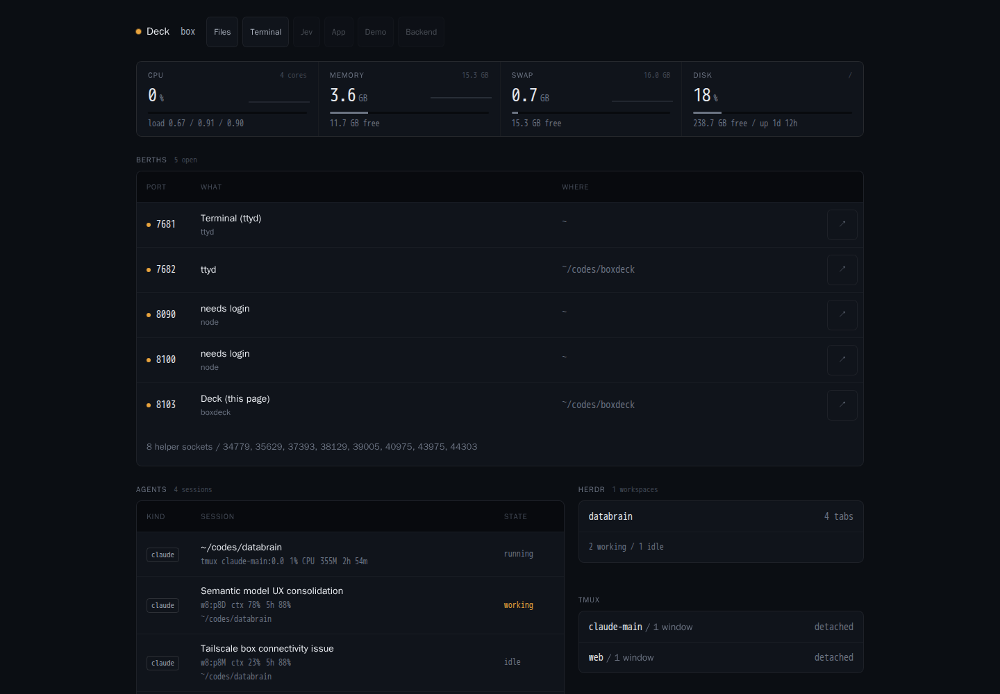
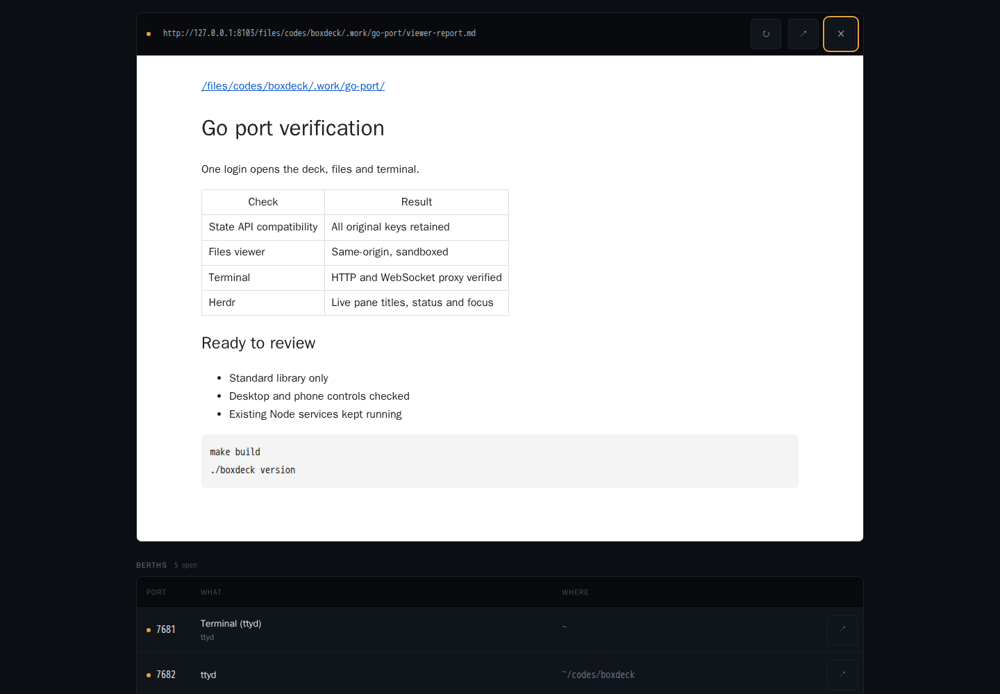
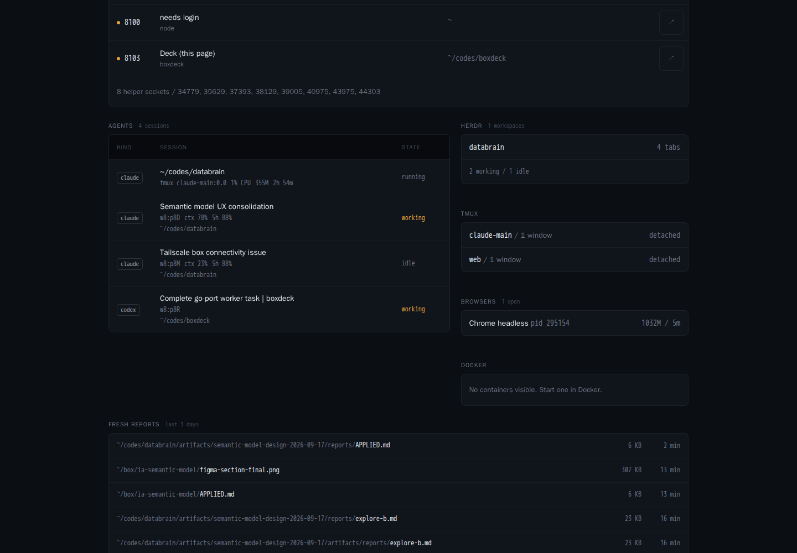
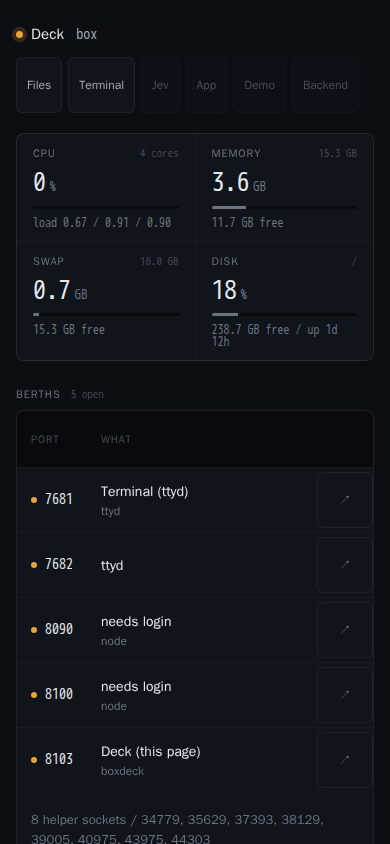
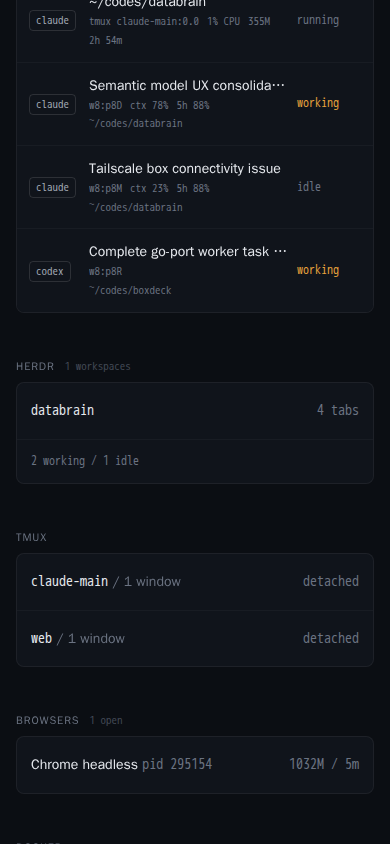

# boxdeck

One bookmark for your remote dev box. A single Go binary serves the deck, files
and terminal through one login.

- **Berths** show listening ports, page titles and working folders. Click a row to
  open the app inside the deck, or use its pop-out button. On a phone, links open a tab.
- **Health** shows CPU, memory, swap, disk, load and recent history.
- **Agents** show running coding tools, their folders, model and tmux pane.
  Herdr sessions also show their title, status, context use and five-hour limit.
- **herdr**, **tmux**, **browsers** and **Docker** show what is running on the box.
- **Fresh reports** link recent Markdown, HTML, images and PDFs through `/files/`.

<!-- before-and-after:start -->
| Before | After |
|:---:|:---:|
|  |  |

| Files inside the deck | Herdr sessions |
|:---:|:---:|
|  |  |

<details><summary>On a phone</summary>

| Deck | Sessions |
|:---:|:---:|
|  |  |

</details>
<!-- before-and-after:end -->

No Node runtime, npm packages or Go dependencies. Linux is the target; macOS
builds provide partial health data. `ss`, `ps`, `tmux`, `docker` and `find` supply
optional machine details. Their results are cached. Browser polling stops in a
hidden tab; health sampling slows from 3 to 30 seconds after 15 seconds without a poll.

## Install

Download the latest tagged release and run the interactive installer:

```sh
curl -fsSL https://raw.githubusercontent.com/wicolian/boxdeck/main/install.sh | sh
```

It chooses Linux or macOS and amd64 or arm64, installs to `~/.local/bin/boxdeck`,
and runs `boxdeck install`. On first install, choose a user, password and hostname.
On Linux it writes and starts `~/.config/systemd/user/boxdeck.service` with
`Nice=10`, then enables linger. Existing config is kept. On macOS, run `boxdeck serve`
after setup; automatic service installation uses Linux systemd.

The downloader needs a published `v*` release containing the Go binaries. To build
from a checkout with Go 1.27 or newer:

```sh
make build
./boxdeck version
./boxdeck install
```

Open `http://<your-box>:8100`. The default bind is loopback; use the automatic
Tailscale mirror or an SSH tunnel to reach it. Keep the deck on a private network.

## One login

The sign-in page sets a signed, HttpOnly, SameSite=Lax cookie for 30 days. Its
32-byte secret lives beside the config in `~/.config/boxdeck/secret`, mode 0600.
Sign out clears the browser cookie. Basic authentication still works for API clients;
unauthenticated API calls receive JSON with status 401, without a browser dialog.

Files live at `/files/`, rooted at your home folder by default. Markdown is rendered
with headings, paragraphs, flat lists, fences, inline code, emphasis, links, images
and tables. Raw Markdown HTML is escaped. HTML and SVG files keep the old sandbox
policy; files send `nosniff`. Paths cannot climb above the configured root. Symlinks
may intentionally point outside it, for example `~/box` pointing to a mount.

Terminal lives at `/term/`. When enabled, boxdeck starts:

```sh
ttyd -p 7681 -i 127.0.0.1 -W --base-path /term tmux new-session -A -s web
```

Install ttyd and tmux to use it. Boxdeck handles authentication and WebSocket traffic;
ttyd has no password of its own and its port is excluded from mirroring. With
`terminal:false`, boxdeck can proxy a separately managed ttyd at `ttydPort`.
The Terminal link dims when the upstream is unavailable.

When migrating an existing ttyd user service, stop it yourself before starting the
Go service, so boxdeck can own port 7681:

```sh
systemctl --user disable --now ttyd.service
```

If the old `files-web.service` owns 8090 and `filesPort` is enabled, stop it too:

```sh
systemctl --user disable --now files-web.service
```

The Go installer replaces `boxdeck.service`. It leaves other services alone.

## Herdr

Requires [herdr](https://github.com/herdrdev/herdr) 0.9 or newer. Boxdeck reads its
local socket at `~/.config/herdr/herdr.sock` while someone is watching, cached for
3 seconds. The card shows workspaces, tab counts and agent counts by status.
It disappears when herdr or its socket is absent.

Agent rows show the pane title, `working` / `idle` / `blocked` / `done` / `unknown`,
context and five-hour limit when supplied, and the pane ID. Click the row to focus
that pane in herdr on the box. The authenticated `/api/herdr/focus` endpoint sends
herdr's `agent.focus` socket request, equivalent to `herdr agent focus <pane_id>`.
Process entries are matched by their inherited herdr pane ID, not their folder name.

## Config

`~/.config/boxdeck/config.json`:

```json
{
  "user": "me",
  "password": "choose-a-password",
  "host": "box",
  "bind": "127.0.0.1",
  "port": 8100,
  "title": "Deck",
  "filesPort": 0,
  "filesRoot": "~",
  "terminal": true,
  "ttydPort": 7681,
  "quick": [["App", 3001]],
  "reportRoots": ["~/reports", "~/box"],
  "reportDays": 3,
  "mirror": "auto",
  "mirrorBind": "",
  "known": {"3001": "My app", "5173": "Vite demo"},
  "hide": [22, 53, 111, 139, 445],
  "agentPattern": "^(\\S*/)?(claude|codex|aider|opencode|goose)(\\s|$)"
}
```

- `host` accepts a hostname or a pasted URL such as `https://box/`. Ports accept
  numbers or strings. The scheme and trailing slash are removed from `host`.
- Files and Terminal shortcuts are included automatically. Old shortcuts named
  Files or Terminal use the new same-origin paths. Other shortcuts dim when closed.
- `filesPort` is only for old links. When greater than zero, that loopback port
  redirects requests to `/files/` on the deck. `filesAuth` remains accepted for
  migration; all files now use the deck login.
- `terminal` defaults to true when ttyd is on PATH. `ttydPort` defaults to 7681.
- `known` labels ports. Other listeners get an HTTP title or a process name.
- Reports outside `filesRoot` remain listed without a link. Title probes cache for
  2 minutes, Docker for 10 seconds and reports for 20 seconds.
- `BOXDECK_CONFIG` chooses a different config file. Existing overrides remain:
  `BOXDECK_PORT`, `BOXDECK_BIND`, `BOXDECK_HOST`, `BOXDECK_USER`, `BOXDECK_PASSWORD`,
  `BOXDECK_FILES_PORT`, `BOXDECK_FILES_ROOT`, `BOXDECK_FILES_AUTH`,
  `BOXDECK_MIRROR`, `BOXDECK_MIRROR_BIND`. Terminal also accepts
  `BOXDECK_TERMINAL` and `BOXDECK_TTYD_PORT`. Use `0` or `false` to disable a boolean.

## Your localhost, from another device

The mirror republishes local listeners on the Tailscale `100.64.0.0/10` address,
using plain TCP for HTTP, WebSockets and HMR. It needs no sudo or `tailscale serve`.
`mirror:auto` enables it when that interface exists; use `false` to disable it or
`mirrorBind` to choose another private address. Hidden ports and the ttyd upstream
are excluded. Other mirrored apps keep their own authentication; the tailnet is
their access boundary. The mirror rescans listeners every 5 seconds even when the
deck is closed. A failed bind shows the port and reason below Berths.

The viewer has a URL, loading state, reload, pop-out and close. Esc closes it.
Files and Terminal use the shared login; other dev servers keep their own origins.
An app that forbids framing can still be opened with the pop-out button.

## Build and release

```sh
go vet ./...
go test ./...
make build
make release
```

`make release` produces `dist/boxdeck_linux_{amd64,arm64}` and
`dist/boxdeck_darwin_{amd64,arm64}` with CGO disabled. A pushed `v*` tag runs the
same build in GitHub Actions and attaches all four binaries to a GitHub Release.

The [Node files in `legacy/`](./legacy/) are frozen for one release.

MIT.
